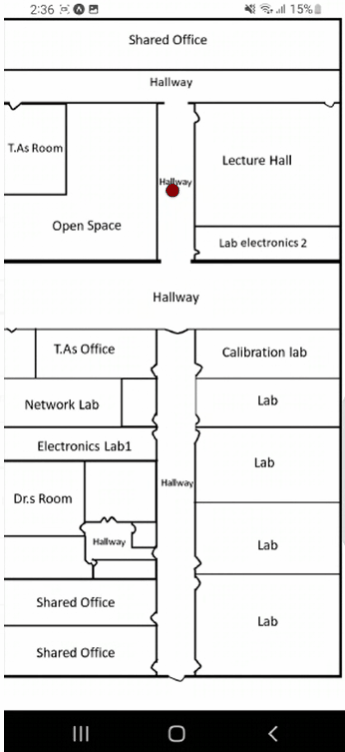

# indoor-localization-iot-task1

## **Team 16**

**Team Members:-**

| Name      | Sec | BN     |
| :---        |    :----:   |          ---: |
| Alaa Seif elnasr Ibrahim | 1       | 11   |
| Habiba Mahmoud           | 1       | 25   |
| Hasan Hosni              | 1       | 26   |
| Mariam Glal Mohamad      | 2       | 25   |

indoor localization system for the biomedical department floor at faculty of engineering at cairo uni

the nodemcu esp8266 chip  collect the surrounding different wifi strength and send them to firebase database then they are read in the machine learning model which send the resulting label to firebase
,and finally the mobile application and the webpage read this label.

